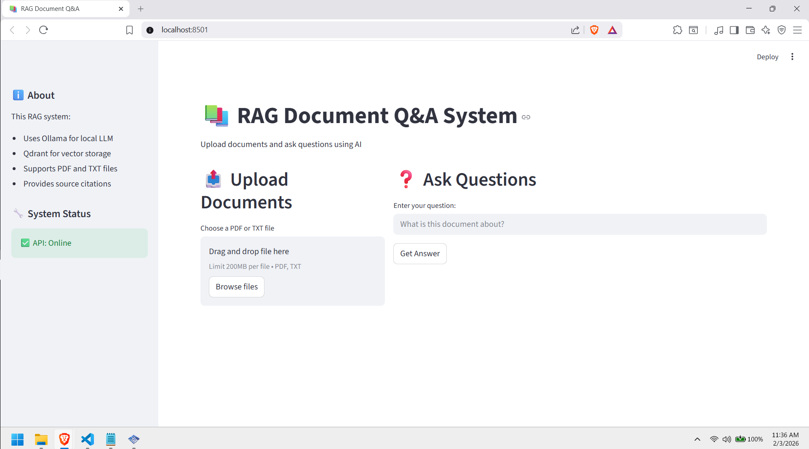
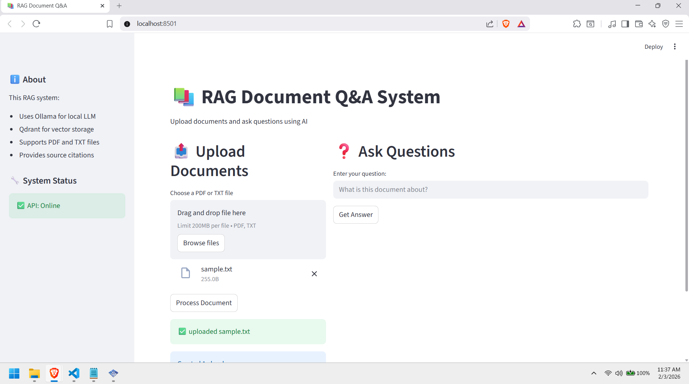
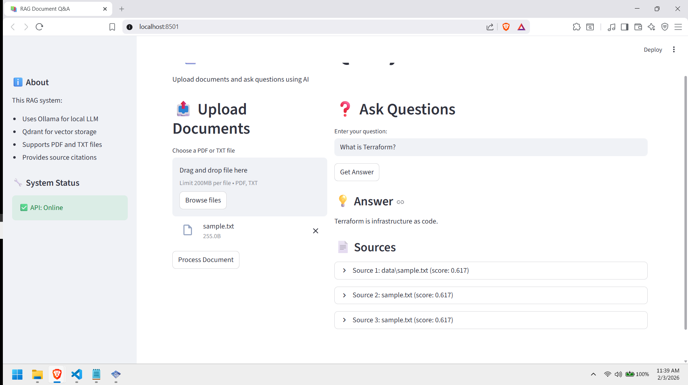

# RAG Pipeline (Hybrid Deployment)

Retrieval-Augmented Generation pipeline with local and cloud LLM support. Upload documents, ask questions, get AI-generated answers with source citations.

## Problem Statement

Organizations need to query large document collections efficiently, but face challenges:

Traditional search returns documents, not answers. Users spend time reading through results to find information. Commercial AI solutions like ChatGPT Enterprise cost $30-60 per user monthly and send data to external servers, raising privacy concerns.

This RAG pipeline addresses these issues by combining vector search with local LLM processing. Documents stay on-premises, answers generate instantly with source citations, and costs remain under $5 monthly for infrastructure.

## Architecture
```
User Browser
    ↓
Streamlit UI (port 8501)
    ↓
FastAPI Backend (port 8000)
    ↓
    ├─→ Qdrant Vector DB (port 6333)
    │   └─→ Document embeddings stored
    │
    └─→ LLM (Hybrid)
        ├─→ Local: Ollama (llama3.2)
        └─→ Cloud: OpenAI API (fallback)
```

Document flow: Upload → Chunk → Embed → Store in Qdrant
Query flow: Question → Embed → Search Qdrant → Retrieve context → Generate answer with LLM

## Screenshots

**Main Interface**

*Clean two-column layout with document upload and question interface*

**Document Upload Success**

*Document processed and chunked into vector embeddings*

**Query Results with Source Citations**

*AI-generated answer with relevance scores and source references*

## Technology Stack

**Vector Database**
Qdrant provides similarity search for document retrieval. Self-hosted in Docker for zero monthly cost and complete data control.

**Embeddings**
nomic-embed-text creates 768-dimension vectors from text chunks. Runs locally via Ollama with no API costs.

**LLM (Hybrid Architecture)**
Local development uses Ollama with llama3.2 model. Production optionally switches to OpenAI API by setting environment variables. Same code runs in both environments.

**Backend**
FastAPI provides REST endpoints for document upload and query operations. CORS enabled for frontend integration.

**Frontend**
Streamlit creates the web interface with file upload, question input, and answer display with source citations.

## Features

**Document Processing**
Supports PDF and TXT files. Automatic chunking with 500 character segments and 50 character overlap. Processes documents in seconds.

**Semantic Search**
Vector similarity search finds relevant content regardless of exact keyword matches. Returns top 3 most relevant chunks with confidence scores.

**Source Citations**
Every answer includes source document references with relevance scores. Users can verify information and explore original content.

**Hybrid LLM**
Automatic switching between local Ollama and OpenAI based on environment. No code changes required for deployment.

**Cost Efficient**
Local deployment costs zero for LLM usage. Self-hosted vector database eliminates monthly fees. Production with OpenAI fallback costs approximately $5 monthly for API calls.

## Deployment

**Prerequisites**
Docker Desktop installed and running
Python 3.8 or higher
Ollama installed locally
4GB free RAM minimum
5GB free disk space

**Setup**

Clone repository:
```
git clone https://github.com/sjlewis25/rag-pipeline.git
cd rag-pipeline
```

Create Python virtual environment:
```
python -m venv venv
source venv/Scripts/activate
pip install -r requirements.txt
```

Start Qdrant vector database:
```
cd vector-db
docker compose up -d
cd ..
```

Pull Ollama models:
```
ollama pull nomic-embed-text
ollama pull llama3.2
```

Initialize vector database:
```
python ingest.py
```

**Running the Application**

Start backend API (terminal 1):
```
python api.py
```

Start frontend UI (terminal 2):
```
streamlit run app.py
```

Access application at http://localhost:8501

**Using OpenAI Fallback**

Set environment variables:
```
export ENVIRONMENT=production
export OPENAI_API_KEY=your-key-here
```

Restart backend. System automatically uses OpenAI API instead of local Ollama.

## Cost Analysis

**Local Deployment (Development)**

| Component | Cost |
|-----------|------|
| Qdrant (Docker) | $0 |
| Ollama LLM | $0 |
| Embeddings | $0 |
| Compute | Existing hardware |
| Total | $0/month |

**Hybrid Deployment (Production)**

| Component | Cost |
|-----------|------|
| Qdrant (Docker) | $0 |
| OpenAI API | ~$5/month (500 queries) |
| Embeddings | $0 (still local) |
| Compute | Existing hardware |
| Total | ~$5/month |

**Comparison to Commercial Solutions**

ChatGPT Enterprise: $30-60 per user monthly
Amazon Kendra: $810 per month base
Pinecone + OpenAI: ~$70-100 monthly

This solution: 95% cost reduction while maintaining data privacy.

## Project Structure
```
rag-pipeline/
├── api.py              # FastAPI backend
├── app.py              # Streamlit frontend
├── ingest.py           # Document processing
├── query.py            # Query testing script
├── requirements.txt    # Python dependencies
├── vector-db/
│   └── docker-compose.yml
├── data/               # Uploaded documents
└── README.md
```

## What I Learned

**Challenge: Memory Constraints**
Initial llama3.2 model required 2.3GB RAM but system only had 1.1GB available. Switching to nomic-embed-text for embeddings reduced memory footprint to 300MB. Learned importance of model size selection for resource-constrained environments.

**Challenge: Dependency Version Conflicts**
LangChain major version upgrade broke imports. Pydantic version mismatch caused validation errors. Resolved by pinning compatible versions in requirements. Reinforced need for dependency management and version control.

**Challenge: API Design for Hybrid LLM**
Creating abstraction layer that works with both Ollama and OpenAI required careful design. Environment variable detection enables zero-code deployment changes. Demonstrates portable architecture pattern applicable to multi-cloud scenarios.

**Skills Developed**
Vector database operations and similarity search implementation. LLM prompt engineering for consistent answer quality. FastAPI backend development with async file handling. Streamlit rapid UI prototyping. Docker containerization for reproducible deployments. Hybrid architecture design for local-first with cloud fallback.

## Security Considerations

**Data Privacy**
Documents and embeddings remain on local infrastructure. OpenAI fallback only sends queries and retrieved context, not full documents. Suitable for sensitive data with proper access controls.

**API Security**
No authentication implemented in current version. Production deployment should add API key validation, rate limiting, and user authentication.

**Network Security**
Services exposed on localhost only by default. Production requires reverse proxy with SSL/TLS termination and firewall rules.

## Future Enhancements

Add authentication and user management for multi-user access. Implement conversation history to enable follow-up questions. Support additional file formats including DOCX and Markdown. Add document management interface for viewing and deleting uploaded files. Deploy frontend to Cloudflare Pages for public access. Implement advanced retrieval with re-ranking and query expansion. Add monitoring and logging for production usage tracking.

## Production Readiness Checklist

**Implemented**
Document upload and processing pipeline
Vector similarity search
LLM integration with local and cloud options
REST API backend
Web interface frontend
Docker containerization for dependencies

**Required for Production**
Authentication and authorization
API rate limiting
Error handling and logging
Backup strategy for vector database
SSL/TLS certificates
Monitoring and alerting
Load testing and performance optimization
Documentation of deployment procedures

## License

MIT License

## Author

Steven Lewis
AWS Solutions Architect Associate
AWS Cloud Practitioner
GitHub: github.com/sjlewis25

